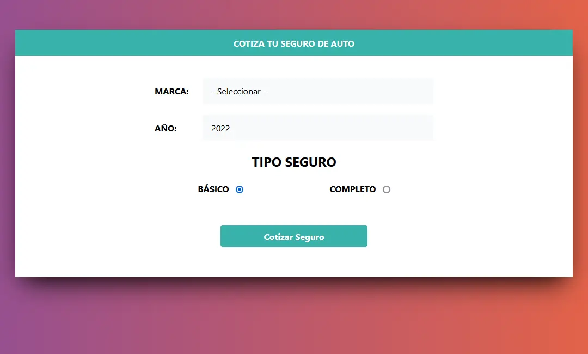

  <h1>Price Calculator 🧮🚗</h1>
  Una pequeña app para calcular polizas de seguro de automoviles

-	Seleccionar la Marca de automovil.
-	Seleccionar el año.
-	Tipo de poliza (Basico, Completo).
-	Lista el resultado y calculo según tipo de poliza, año y marca del automovil.

## Demo 
Para mirar la demo del proyecto visita: [Price Calculator](https://jsproyecto5.netlify.app/)

 
## **Construido con 🛠️**

- [JavaScript](https://www.javascript.com/) - Implementando el uso de prototypes y constructores.
- [CSS](https://www.w3schools.com/css/) - Para dar estilo a la pagina web y el framework **Tailwind**.
- [HTML](https://developer.mozilla.org/es/docs/Web/HTML) - Usado para la estructura del contenido web app.

## **Autores ✒️**
*Gracias al tutor por enseñar y sus clases - excelente curso para arrancar en Java Script puro y especializarte*

- **Juan Pablo De la torre Valdez** - *Curso* - [Codigo Con Juan](https://codigoconjuan.com/)
- **Mario Karajallo** - *Codigo* - [Mario Karajallo](https://karajallo.com)

## **Licencia 📄**
Este proyecto está bajo MIT License - mira el archivo [LICENSE.md](https://github.com/mariokarajallo/price-calculator-javascript/blob/main/LICENSE) para detalles

## **Expresiones de Gratitud 🎁**
- Comenta a otros sobre este proyecto para aprender más sobre Java Script 📢
- Invita una cerveza 🍺 o un café ☕.
- Gracias por pasarte a ver el Readme hecho con mucha paciencia 🤓.

---

⌨️ con ❤️ por [Mario Karajallo](https://karajallo.com) 😊